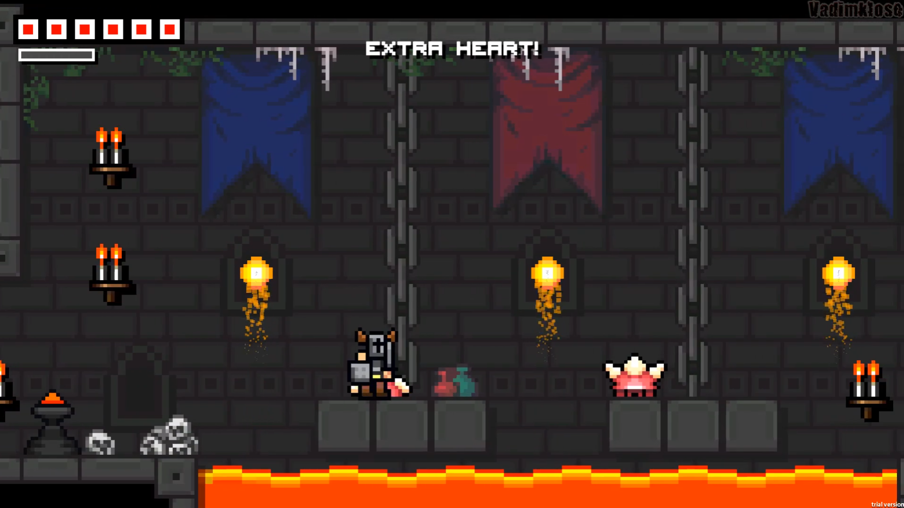

<!-- GENERAL GAME INFO -->
 

  <h1 align="center">Horned Knight</h1>

  

    Horned Knight is a challenging 2D action-platformer where you must overcome all fears, enemies, and traps as the Hero Knight.
     
    <strong>Original game : </strong>
    <a href="https://www.nintendo.co.uk/Games/Nintendo-Switch-download-software/Horned-Knight-1921119.html"><strong>General info »</strong></a>
    ·
    <a href="https://www.youtube.com/watch?v=9JOZ9Hnb6L8&t=8s"><strong>Youtube video »<strong></a>
     
     
  

<!-- TABLE OF CONTENTS -->

  
Table of Contents

  <ol>
    <li>
      <a href="#about-the-project">About The Project</a>
    </li>
    <li>
      <a href="#my-version">My version</a>
    </li>
    <li>
      <a href="#getting-started">Getting Started</a>
    </li>
    <li><a href="#how-to-play">How To Play</a></li>
    <li><a href="#class-structure">Class structure</a></li>
    <li><a href="#checklist">Checklist</a></li>
    <li><a href="#contact">Contact</a></li>
    <li><a href="#acknowledgments">Acknowledgments</a></li>
  </ol>

<!-- ABOUT THE PROJECT -->
## About The Project

 

Here's why:
* The game is challenging and fun
* It has multiple cool mechanics like dash and wall jumping
* The art style is easy to replicate

(<a href="#readme-top">back to top</a>)

## My version

This section gives a clear and detailed overview of which parts of the original game I planned to make.

### The minimum I will most certainly develop:
* Attacking 
* The movement mechanics
* The health and damage
* The ground "troops"/ enemies

### What I will probably make as well:
* Particle system
* The extra heart system

### What I plan to create if I have enough time left:
* A boss, because the boss level is separate and I wanted to add them both

(<a href="#readme-top">back to top</a>)

<!-- GETTING STARTED -->
## Getting Started
Detailed instructions on how to run your game project are in this section.

### Prerequisites

This is an example of how to list things you need to use the software and how to install them.
* Visual Studio 2022

### How to run the project

Just build and run the project using Visual Studio

(<a href="#readme-top">back to top</a>)

<!-- HOW TO PLAY -->
## How to play

Use this space to show useful examples of how a game can be played. 
Additional screenshots and demos work well in this space. 

### Controls
* A-move left
* D-move right
* SPACE-jump
* Left Mouse Click - attack
* LSHIFT- dash

(<a href="#readme-top">back to top</a>)

<!-- CLASS STRUCTURE -->
## Class structure 

### Object composition 
If you applied object composition (optional); explain where and how.

### Inheritance 
Haven't applied inheritance yet, I'm gonna use it for the enemies

### ..

(<a href="#readme-top">back to top</a>)

<!-- CHECKLIST -->
## Checklist

- [x] Accept / set up github project
- [ ] week 01 topics applied
    - [x] const keyword applied proactively (variables, functions,..)
    - [x] static keyword applied proactively (class variables, static functions,..)
    - [ ] object composition (optional)
- [ ] week 02 topics applied
- [ ] week 03 topics applied
- [ ] week 04 topics applied
- [ ] week 05 topics applied
- [ ] week 06 topics applied
- [ ] week 07 topics applied
- [ ] week 08 topics applied
- [ ] week 09 topics applied (optional)
- [ ] week 10 topics applied (optional)

(<a href="#readme-top">back to top</a>)

<!-- CONTACT -->
## Contact

Dontu Cristian - cristi.dontu@student.howest.be

Project Link: [https://github.com/your_username/repo_name](https://github.com/your_username/repo_name)

(<a href="#readme-top">back to top</a>)

<!-- ACKNOWLEDGMENTS -->
## Acknowledgments

Use this space to list resources you find helpful and would like to give credit to. 

* [Example 1: cpp reference on std::vector](https://en.cppreference.com/w/cpp/container/vector)
* ..

(<a href="#readme-top">back to top</a>)

