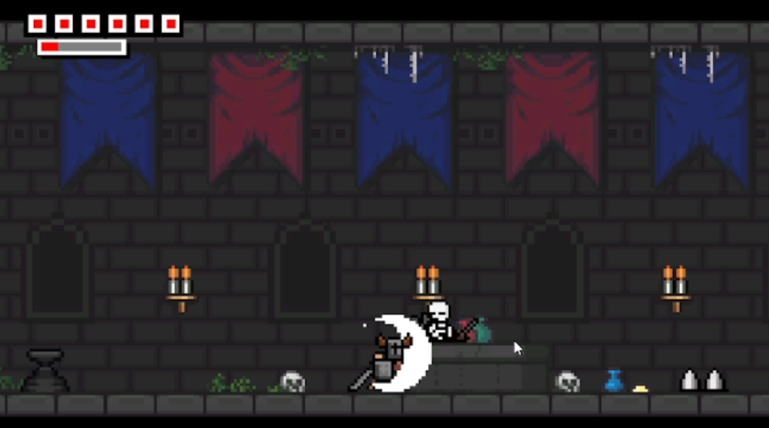
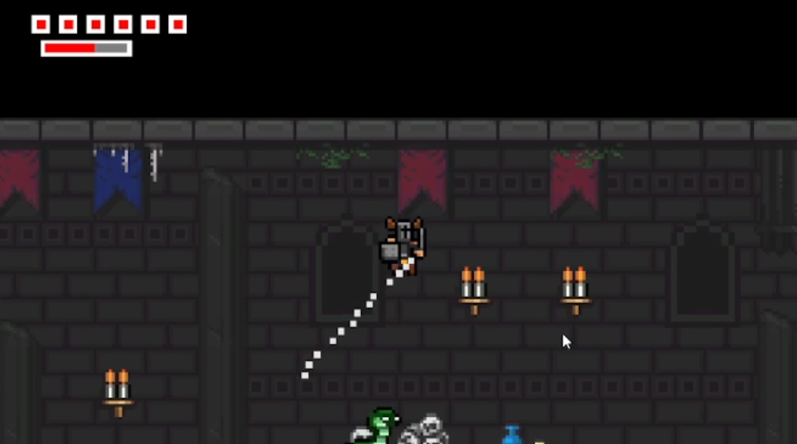
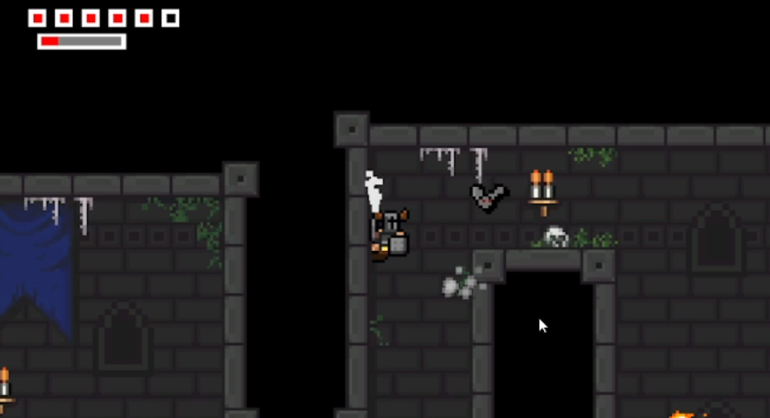

<!-- GENERAL GAME INFO -->
 

  <h1 align="center">Horned Knight</h1>

  

    Horned Knight is a challenging 2D action-platformer where you must overcome all fears, enemies, and traps as the Hero Knight.
     
    <strong>Original game : </strong>
    <a href="https://www.nintendo.co.uk/Games/Nintendo-Switch-download-software/Horned-Knight-1921119.html"><strong>General info »</strong></a>
    ·
    <a href="https://www.youtube.com/watch?v=9JOZ9Hnb6L8&t=8s"><strong>Youtube video »<strong></a>
     
     
  

<!-- TABLE OF CONTENTS -->

  
Table of Contents

  <ol>
    <li>
      <a href="#about-the-project">About The Project</a>
    </li>
    <li>
      <a href="#my-version">My version</a>
    </li>
    <li>
      <a href="#getting-started">Getting Started</a>
    </li>
    <li><a href="#how-to-play">How To Play</a></li>
    <li><a href="#class-structure">Class structure</a></li>
    <li><a href="#checklist">Checklist</a></li>
    <li><a href="#contact">Contact</a></li>
    <li><a href="#acknowledgments">Acknowledgments</a></li>
  </ol>

<!-- ABOUT THE PROJECT -->
## About The Project

 

Here's why:
* The game is challenging and fun
* It has multiple cool mechanics like dash and wall jumping
* The art style is easy to replicate

(<a href="#readme-top">back to top</a>)

## My version

This section gives a clear and detailed overview of which parts of the original game I planned to make.

### The minimum I will most certainly develop:
* Attacking 
* The movement mechanics
* The health and damage
* The ground "troops"/ enemies

### What I will probably make as well:
* Particle system
* The extra heart system

### What I plan to create if I have enough time left:
* A boss, because the boss level is separate and I wanted to add them both

(<a href="#readme-top">back to top</a>)

<!-- GETTING STARTED -->
## Getting Started

### Prerequisites

* Visual Studio 2022

### How to run the project

Just build and run the project using Visual Studio

(<a href="#readme-top">back to top</a>)

<!-- HOW TO PLAY -->
## How to play
To kill an enemy you just have to aproach it and click attack, 
then if you are within the players melee range then the enemy will die.
 
To dash you have to press LShift and using the W,A,D keys you control the dash direction.
A for left, D for right and W, WA, WD for going diagonally either left or right.
 
To wall slide you have to be above the ground and keep holding either A (if the wall is left of you )
or D (if the wall is rigth of you) next to the wall.
If you release any of them you'll just fall to the ground. If you want to wall jump, just press Space while wall sliding.
 

### Controls
* A-move left
* D-move right
* SPACE-jump
* Left Mouse Click - attack
* LSHIFT- dash

(<a href="#readme-top">back to top</a>)

<!-- CLASS STRUCTURE -->
## Class structure 

### Object composition 
If you applied object composition (optional); explain where and how.

### Inheritance 
I used inheritance for some of the Damage Zones classes, like the Kill Zones

### Polymorphism
I used polymorphism for a lot of my classes, like the Particle class which has 3 derived classes with different behaviour.
I used polymorphism for other classes which have multiple object types with similar behaviour, like the Platform which splits into Moving and Fading, 
or the damage zones some of them being moveable some having specific behaviour or animations while others don't.

(<a href="#readme-top">back to top</a>)

<!-- CHECKLIST -->
## Checklist

- [x] Accept / set up github project
- [x] week 01 topics applied
    - [x] std::vector
    - [x] Transformations
- [x] week 02 topics applied
    - [x] const keyword applied proactively (variables, functions,..)
    - [x] static keyword applied proactively (class variables, static functions,..)
    - [x] object composition (optional)
- [x] week 03 topics applied
    - [x] inheritance 
- [x] week 04 topics applied
    - [x] polymorphism
    - [x] (pure),virtual, override
    - [x] typecasting (dynamic,static..)
- [ ] week 05 topics applied
    - [ ] operator overloading
    - [ ] friends
- [ ] week 06 topics applied
   -[x] rule of 3
- [ ] week 07 topics applied
    - [ ] value categories
    - [ ] references part 1
- [x] week 08 topics applied
    - [x] move semantics rule of 5
    - [ ] references part 2
- [ ] week 09 topics applied (optional)
    - [ ] output formatting
    - [ ] File IO
- [ ] week 10 topics applied (optional)
    - [ ] error handling

(<a href="#readme-top">back to top</a>)

<!-- CONTACT -->
## Contact

Donțu Cristian - cristi.dontu@student.howest.be

Project Link: [https://github.com/HowestDAE/dae14-DontuCristian](https://github.com/HowestDAE/dae14-DontuCristian)

(<a href="#readme-top">back to top</a>)

<!-- ACKNOWLEDGMENTS -->
## Acknowledgments

Use this space to list resources you find helpful and would like to give credit to. 

* [Cpp reference on std::vector](https://en.cppreference.com/w/cpp/container/vector)
* [Refactoring Guru on Singleton](https://refactoring.guru/design-patterns/singleton)

(<a href="#readme-top">back to top</a>)

